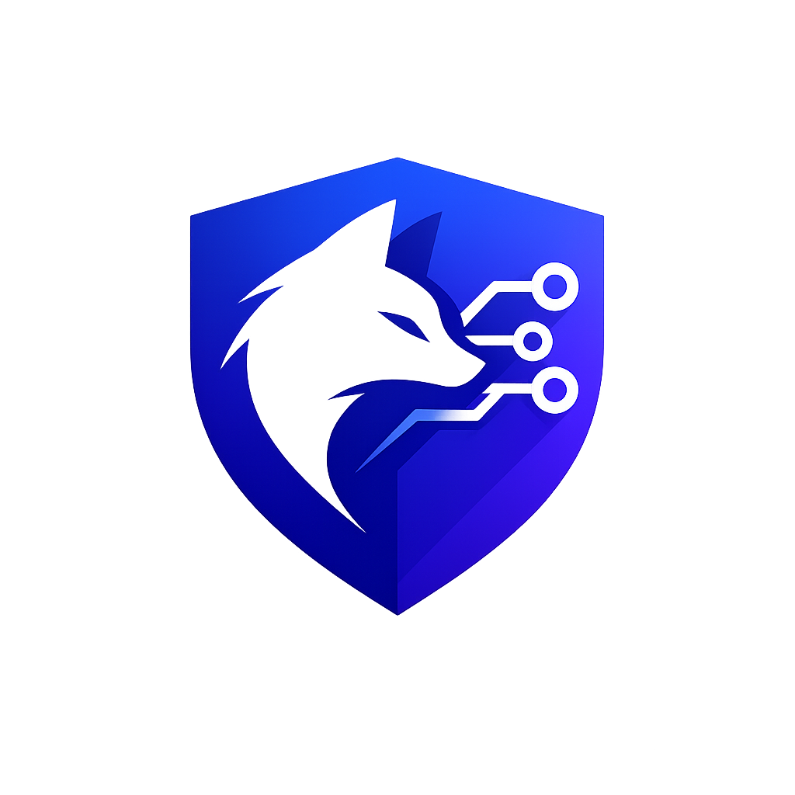

<div align="center">



# FOXHOLE

### **Dominate the Boardroom Before You Walk In.**

*An AI-powered boardroom simulation engine that stress-tests corporate proposals against adversarial AI directors — with enterprise-grade data security through Veea Lobster Trap DPI compliance.*

[](https://nextjs.org)
[](https://ai.google.dev)
[](https://sdk.vercel.ai)
[](https://tailwindcss.com)
[](https://recharts.org)
[](https://veea.com)
[](https://typescriptlang.org)
[](LICENSE)

---

*Built for the **Transforming Enterprise Through AI** Hackathon on lablab.ai*

</div>

---

## 📋 Table of Contents

- [The Problem](#-the-problem)
- [The Solution](#-the-solution)
- [Key Features](#-key-features)
- [Architecture](#-architecture)
- [Technology Stack](#-technology-stack)
- [Getting Started](#-getting-started)
- [Application Walkthrough](#-application-walkthrough)
- [API Reference](#-api-reference)
- [Veea Lobster Trap Integration](#-veea-lobster-trap-integration)
- [AI Prompt Engineering](#-ai-prompt-engineering)
- [Design System](#-design-system)
- [Project Structure](#-project-structure)
- [Performance](#-performance)
- [Future Roadmap](#-future-roadmap)
- [Built By](#-built-by)

---

## 🎯 The Problem

> **74% of high-stakes corporate proposals are rejected or sent back for revision on their first board hearing.**
>
> — *McKinsey Corporate Governance Report, 2024*

In mergers, acquisitions, and large-scale technology transitions, the proposal itself is rarely the problem — **the failure point is the boardroom defense**. Executives face:

| Challenge | Impact | Current "Solution" |
|-----------|--------|-------------------|
| 🔴 **Hostile financial scrutiny** from CFOs obsessed with margin protection | Proposals delayed 3–6 months | Slide decks with backup appendices |
| 🔴 **Deep technical cross-examination** from CTOs questioning architectural viability | Engineering credibility destroyed | Whiteboard sessions with peers |
| 🔴 **Compliance landmines** from independent directors protecting fiduciary duty | Legal exposure and blocked votes | External counsel review ($50K+) |
| 🔴 **Sensitive data exposure** when rehearsing with AI tools | M&A details leaked to cloud models | No solution exists |

### The Gap in the Market

Teams currently prepare with **static slide decks** and **generic ChatGPT conversations**. This approach has two fatal flaws:

1. **No adversarial pressure** — ChatGPT agrees with everything. Real board members don't.
2. **Zero data security** — Sensitive M&A financials, employee data, and acquisition targets are sent to public cloud models with no PII protection, no audit trail, and no compliance guarantees.

**Foxhole exists to close both gaps simultaneously.**

---

## 💡 The Solution

**Foxhole** is a full-scale AI boardroom rehearsal simulator and risk compliance engine.

<div align="center">

| Pillar | What It Does | How It Works |
|--------|-------------|--------------|
| 🎭 **Adversarial Simulation** | Spawns AI board members with distinct biases and governance styles | Each director (CFO, CTO, Lead Independent) has a unique persona, focus area, and adversarial questioning pattern powered by Gemini 2.5 Flash |
| 📊 **Live Strategic Assessment** | Tracks approval probability per board member in real-time | Background evaluation engine analyzes dialogue quality, diagnoses risk vulnerabilities, and generates tactical mitigation suggestions |
| 🔒 **Lobster Trap Security** | Ensures zero PII leakage during sensitive M&A rehearsals | All prompts intercepted by Veea's local DPI proxy on port 8080 for compliance scanning before reaching the AI backend |
| 📄 **Export-Ready Debrief** | Generates print-ready strategic assessment reports | Radar charts, SWOT analysis, risk remediation cards compiled into a PDF-optimized layout |

</div>

### What Makes Foxhole Different

| Approach | Adversarial Pressure | Data Security | Quantified Feedback | Export-Ready |
|----------|:-------------------:|:-------------:|:-------------------:|:------------:|
| Slide Decks | ❌ | ✅ | ❌ | ✅ |
| ChatGPT / Claude | ❌ | ❌ | ❌ | ❌ |
| Paid Consultants | ✅ | ✅ | ❌ | ✅ |
| **Foxhole** | **✅** | **✅** | **✅** | **✅** |

---

## ✨ Key Features

### 🎭 Adversarial Board Simulation
- **Three pre-configured board personas** with distinct biases:
  - **Sarah Jenkins (CFO)** — Margin-obsessed, questions ROI timelines, demands hard financial projections
  - **Dr. Aris Vance (CTO)** — Engineering-focused, probes architectural decisions, challenges scalability claims
  - **Marcus Sterling (Lead Independent Director)** — Compliance-hardened, flags regulatory exposure, protects fiduciary duty
- **Configurable rigor levels** — Friendly (onboarding), Standard (typical board), Stress-Test (hostile takeover defense)
- **Real-time streaming responses** — Board members respond word-by-word using Vercel AI SDK streaming, creating a realistic conversational rhythm
- **Speaker switching** — Address different board members mid-simulation to practice targeted persuasion

### 📊 Live Strategic Assessment Dashboard
- **Board Approval Rating** — A single composite score (0–100%) representing overall likelihood of board approval
- **Per-member alignment tracking** — Individual approval scores for each board member, updated after every exchange
- **Risk Vulnerability Feed** — Up to 3 critical risks diagnosed in real-time, categorized as:
  - 🔴 `Financial` — Revenue, margin, or cost-related exposure
  - 🟡 `Technical` — Architecture, scalability, or integration risks
  - 🟣 `Compliance` — Regulatory, legal, or governance concerns
- **Severity indicators** — Each risk tagged as HIGH, MEDIUM, or LOW
- **Actionable mitigation suggestions** — Specific tactical advice to neutralize each diagnosed risk
- **Fiduciary Tactical Tip** — A single high-level coaching prompt targeting the most skeptical board member

### 📄 Strategic Debrief Reports
- **Alignment Index** — Color-coded composite score with descriptive status (Strong Alignment / Review Required / Critical Gaps)
- **Fiduciary Vector Distribution** — Recharts Polar Radar chart mapping multi-dimensional approval across financial, technical, compliance, strategic, and operational axes
- **SWOT Strategic Matrix** — Auto-generated Strengths, Weaknesses, Opportunities, and Threats based on simulation dialogue
- **Risk Remediation Feed** — Every diagnosed vulnerability with its mitigation strategy
- **One-click PDF Export** — Fully styled print layout with custom CSS `@media print` rules for physical boardroom distribution

### 🔒 Veea Lobster Trap DPI Security
- **Automatic proxy detection** — Navbar displays live compliance status badge
- **PII scanning** — All outbound prompts scanned for personally identifiable information
- **Prompt injection defense** — Detects and neutralizes system override attempts
- **Graceful degradation** — If proxy is offline, system falls back to direct encrypted API endpoints with clear visual indicators
- **Audit logging** — Full transparent trail of every prompt inspection

### 🎨 Premium Dark Theme UI
- **Custom glassmorphic design system** — Frosted glass panels, layered gradients, ambient glows
- **Motion design** — Framer Motion spring animations, staggered reveals, hover micro-interactions
- **Typography** — Inter (body) + Outfit (headings) via Google Fonts
- **Responsive** — Fully functional on desktop, tablet, and mobile viewports
- **Print-optimized** — Debrief page includes dedicated `@media print` stylesheet

---

## 🏗️ Architecture

### System Flow

```
┌──────────────────┐         ┌───────────────────────┐         ┌──────────────────┐
│                  │         │                       │         │                  │
│   Next.js 16     │────────▶│   Veea Lobster Trap   │────────▶│   Google Gemini  │
│   Client App     │         │   DPI Proxy           │         │   2.5 Flash      │
│                  │◀────────│   (Port 8080)         │◀────────│                  │
│   • Setup Page   │         │                       │         │   • Streaming    │
│   • War Room     │         │   ┌─────────────────┐ │         │     Simulation   │
│   • Debrief      │         │   │ PII Scanner     │ │         │   • JSON         │
│                  │         │   │ Injection Filter│ │         │     Evaluation   │
│                  │         │   │ Audit Logger    │ │         │                  │
└──────────────────┘         │   └─────────────────┘ │         └──────────────────┘
        │                    └───────────────────────┘                  │
        │                              │                               │
        ▼                              ▼                               ▼
┌──────────────────┐    ┌───────────────────────┐    ┌──────────────────────────┐
│  Real-Time UI    │    │  Compliance Audit      │    │  Strategic Assessment    │
│                  │    │  Trail                 │    │                          │
│  • Stream Chat   │    │  • PII Match Count     │    │  • Approval Ratings      │
│  • Live Scores   │    │  • Injection Attempts  │    │  • Risk Vulnerabilities  │
│  • Risk Feed     │    │  • Block/Pass Log      │    │  • SWOT Analysis         │
│  • Tactical Tips │    │                        │    │  • PDF Export            │
└──────────────────┘    └───────────────────────┘    └──────────────────────────┘
```

### Data Flow — Single User Interaction

```
1. User types response in War Room chat
          │
          ▼
2. POST /api/simulate
   ├── Construct system prompt with:
   │   ├── Board member persona & bias description
   │   ├── Proposal context (title + description)
   │   ├── Full message history
   │   └── Rigor level weight multiplier
   │
   ├── Route through Lobster Trap (if active)
   │   └── PII scan → Injection check → Audit log
   │
   └── Stream response via Gemini 2.5 Flash
       └── toTextStreamResponse() → ReadableStream
                    │
                    ▼
3. Client reads stream chunks in real-time
   └── Updates message bubble word-by-word
                    │
                    ▼
4. POST /api/evaluate (triggered after stream completes)
   ├── Full dialogue history + proposal context
   ├── Gemini generates structured JSON assessment:
   │   ├── generalApproval (0-100)
   │   ├── boardMemberRatings { cfo, cto, lead-dir }
   │   ├── risks [ { type, risk, severity, suggestion } ]
   │   └── strategicTip
   │
   └── Server strips markdown fences, validates JSON
                    │
                    ▼
5. Right panel updates with live assessment data
```

---

## 🔧 Technology Stack

| Layer | Technology | Purpose |
|-------|-----------|---------|
| **Framework** | Next.js 16.2.6 (App Router) | Server-side rendering, API routes, file-based routing |
| **Bundler** | Turbopack | Blazing-fast development builds |
| **Language** | TypeScript | Type safety across the entire codebase |
| **AI Model** | Google Gemini 2.5 Flash | Sub-second latency for streaming dialogue and structured evaluation |
| **AI SDK** | Vercel AI SDK 4.x | `streamText()` for streaming, `generateText()` for structured output |
| **Security** | Veea Lobster Trap | Local DPI proxy for PII scanning and prompt injection defense |
| **Styling** | Tailwind CSS 4 | Utility-first CSS with custom glassmorphic design tokens |
| **UI Components** | shadcn/ui | Radix-based accessible component primitives |
| **Animation** | Framer Motion (motion/react) | Spring-based animations, viewport-triggered reveals |
| **Charts** | Recharts | Polar radar charts and dynamic data visualization |
| **Typography** | Inter + Outfit | Google Fonts loaded via `next/font` |
| **Icons** | Lucide React | Consistent icon system across all components |

---

## 🚀 Getting Started

### Prerequisites

- **Node.js 18+** (LTS recommended)
- **npm** or **yarn**
- A **Google AI Studio API key** → [Get one here](https://aistudio.google.com)
- *(Optional)* Veea **Lobster Trap** container running on port 8080

### Quick Start

```bash
# 1. Clone the repository
git clone https://github.com/Shreekumar-Shah-AICTE/foxhole.git
cd foxhole

# 2. Install dependencies
npm install

# 3. Configure environment variables
cp .env.example .env.local
```

Edit `.env.local` and add your API key:
```env
GEMINI_API_KEY=your_google_ai_studio_api_key_here
LOBSTER_TRAP_URL=http://localhost:8080   # optional
```

```bash
# 4. Start the development server
npm run dev
```

Open **[http://localhost:3000](http://localhost:3000)** — you're ready to rehearse.

### Production Build

```bash
# Build for production
npm run build

# Start production server
npm start
```

### Environment Variables Reference

| Variable | Required | Default | Description |
|----------|:--------:|---------|-------------|
| `GEMINI_API_KEY` | ✅ | — | Google AI Studio API key for Gemini 2.5 Flash |
| `LOBSTER_TRAP_URL` | ❌ | `http://localhost:8080` | URL of the Veea Lobster Trap DPI proxy container |

> **🔄 Graceful Fallback:** If Lobster Trap is not running, the app automatically falls back to direct encrypted API calls. The navbar badge turns amber to indicate "Direct Rehearsal" mode. No functionality is lost.

---

## 🖥️ Application Walkthrough

### Page 1: Landing (`/`)

The landing page immediately communicates the product value proposition:

- **Logo hero** with Foxhole brand identity and ambient glow
- **Problem statistics** — 74% rejection rate, 40h+ prep time saved, $200K+ value reclaimed
- **Three capability pillars** — Adversarial Simulation, Live Assessment, Debrief Reports
- **Lobster Trap security showcase** — Terminal mockup showing PII scanning in action
- **Tech stack badges** — One-glance technology overview
- **Bottom CTA** — Direct launch into simulation setup

### Page 2: Setup (`/setup`)

The configuration wizard for each boardroom rehearsal:

- **Proposal Title** — Name your strategic initiative (e.g., "Strategic Acquisition of CloudVault for $47M")
- **Proposal Description** — Full context with financial projections, timelines, and risk factors
- **Board Member Selection** — Pre-configured adversarial personas (CFO, CTO, Lead Director)
- **Rigor Level Selector** — Friendly / Standard / Stress-Test
- **Enter Boardroom** button launches the simulation with all parameters

### Page 3: Simulation (`/simulation`)

The War Room — the core product experience:

- **Left panel** — Full chat interface with streaming AI responses
  - User messages (right-aligned, blue-tinted)
  - Board member responses (left-aligned, dark glass)
  - Word-by-word streaming for realistic conversational pacing
  - Speaker switching tabs at the top
- **Right panel** — Live strategic assessment dashboard
  - Board Approval Rating gauge
  - Per-member alignment scores
  - Risk Vulnerability Feed (up to 3 cards)
  - Fiduciary Tactical Tip
- **Footer** — Lobster Trap compliance status

### Page 4: Debrief (`/debrief`)

The strategic assessment output:

- **Alignment Index** — Composite approval percentage
- **Radar Chart** — Multi-dimensional fiduciary vector distribution (Recharts PolarGrid)
- **SWOT Matrix** — Strengths, Weaknesses, Opportunities, Threats
- **Risk Remediation Feed** — Each vulnerability with actionable mitigation
- **Lobster Trap Audit Badge** — Verification that all traffic was compliance-scanned
- **Print PDF** — Browser-native print dialog with custom print stylesheet

---

## 📡 API Reference

### `POST /api/simulate`

Streams an adversarial board member response.

**Request Body:**
```json
{
  "proposalTitle": "Strategic Acquisition of CloudVault",
  "proposalDesc": "Full proposal context...",
  "boardMembers": [
    {
      "id": "cfo",
      "name": "Sarah Jenkins",
      "role": "Chief Financial Officer",
      "personaDescription": "Margin-obsessed, demands hard ROI numbers..."
    }
  ],
  "messages": [
    { "role": "user", "content": "Our projected ROI is 340%..." },
    { "role": "assistant", "name": "Sarah Jenkins", "content": "..." }
  ],
  "activeMemberId": "cfo",
  "rigorLevel": "stress"
}
```

**Response:** `text/event-stream` — Raw text chunks streamed via `toTextStreamResponse()`

### `POST /api/evaluate`

Returns a structured strategic assessment of the dialogue.

**Request Body:**
```json
{
  "proposalTitle": "...",
  "proposalDesc": "...",
  "boardMembers": [...],
  "messages": [...],
  "rigorLevel": "stress"
}
```

**Response:**
```json
{
  "generalApproval": 67,
  "boardMemberRatings": {
    "cfo": 45,
    "cto": 72,
    "lead-dir": 58
  },
  "risks": [
    {
      "type": "financial",
      "risk": "Integration costs may exceed projected margins...",
      "severity": "high",
      "suggestion": "Present a phased deployment model..."
    }
  ],
  "strategicTip": "Address the CFO's concerns about Q3 margins..."
}
```

### `GET /api/lobster-trap/status`

Healthcheck endpoint for Lobster Trap DPI proxy connectivity.

**Response:**
```json
{
  "active": true,
  "url": "http://localhost:8080",
  "latency": "12ms"
}
```

---

## 🔒 Veea Lobster Trap Integration

### Overview

Foxhole integrates with [Veea's Lobster Trap](https://veea.com) — a local DPI (Deep Packet Inspection) proxy that intercepts all outbound network traffic and applies compliance rules before allowing transmission.

### How It Works

```
User Input → Next.js API Route → Lobster Trap (port 8080) → Gemini API
                                       │
                                       ├── PII Scan: Names, SSNs, emails, phone numbers
                                       ├── Injection Filter: System prompt overrides
                                       ├── Metadata Audit: IP addresses, session tokens
                                       └── Audit Log: Full trail of inspections
```

### Navbar Status Badge

The Navbar polls `/api/lobster-trap/status` every 30 seconds and displays:

| Badge | Meaning |
|-------|---------|
| 🟣 **Lobster Trap Secure** | Proxy is active. All traffic is intercepted and audited |
| 🟡 **Direct Rehearsal** | Proxy is offline. Graceful fallback to direct API |
| ⚪ **Connecting proxy...** | Initial connection test in progress |

### Fallback Behavior

If the Lobster Trap container is not running:
1. The healthcheck endpoint returns `{ active: false }`
2. API routes send requests directly to Gemini (bypassing proxy)
3. The Navbar badge turns amber with "Direct Rehearsal" label
4. **No functionality is lost** — the app works identically, but without DPI auditing

---

## 🧠 AI Prompt Engineering

### Simulation Prompt Architecture

The board member simulation prompt is structured in layers:

1. **Identity Layer** — Defines the AI's role as a specific board member persona
2. **Context Layer** — Injects proposal title, description, and full message history
3. **Bias Layer** — Applies persona-specific questioning biases (financial, technical, compliance)
4. **Rigor Layer** — Modulates adversarial intensity based on selected rigor level:
   - `friendly` — Supportive with gentle probing
   - `standard` — Professional skepticism with pointed questions
   - `stress` — Hostile cross-examination seeking to expose every weakness

### Evaluation Prompt Architecture

The strategic assessment uses a separate `generateText()` call with strict JSON output formatting:

1. **Scoring Instruction** — Dynamic, realistic scoring based on dialogue quality
2. **Risk Diagnosis** — Categorized risk extraction with severity classification
3. **Mitigation Generation** — Actionable suggestions for each identified risk
4. **Tactical Coaching** — Single high-level tip targeting the most skeptical member

**Anti-Hallucination Safeguard:** The evaluation prompt explicitly instructs: *"If the user makes weak points, fails to answer numbers, or ignores compliance, deduct scores aggressively."* This prevents inflated approval ratings that would undermine the simulator's value.

**Markdown Fence Stripping:** Gemini occasionally wraps JSON responses in `` ```json `` code fences despite being instructed not to. The API route strips these server-side and re-validates the JSON before returning to the client.

---

## 🎨 Design System

### Color Palette

| Token | Value | Usage |
|-------|-------|-------|
| `--background` | `#030612` | Primary background |
| `--card` | `#050917` | Card surfaces |
| `--primary` | `#2563EB` → `#6366F1` | Blue to indigo gradient (CTAs, accents) |
| `--destructive` | `#EF4444` | Error states, high-severity risks |
| `--accent` | `#8B5CF6` | Purple (Lobster Trap branding) |

### Typography

| Font | Weight | Usage |
|------|--------|-------|
| **Outfit** | 700–900 | Headings, brand name |
| **Inter** | 400–700 | Body text, UI elements |
| **Geist Mono** | 400 | Terminal mockup, code |

### Animation Patterns

| Pattern | Config | Usage |
|---------|--------|-------|
| **Spring reveal** | `stiffness: 120, damping: 18` | Page load entrance animations |
| **Stagger children** | `delay: 0.12s` | Card grid progressive reveals |
| **Hover scale** | `scale: 1.02–1.03` | Interactive card and button feedback |
| **Viewport trigger** | `whileInView, once: true` | Scroll-triggered section animations |
| **Pulse** | `animate-pulse` | Lobster Trap status dot, live indicators |

### Glass Panel System

```css
.glass-panel {
  background: rgba(255, 255, 255, 0.02);
  border: 1px solid rgba(255, 255, 255, 0.06);
  backdrop-filter: blur(12px);
}
```

---

## 📁 Project Structure

```
foxhole/
├── public/
│   └── foxhole-logo.png          # Brand logo (shield + fox + circuit)
│
├── src/
│   ├── app/
│   │   ├── page.tsx              # Landing page — logo hero, stats, features, security
│   │   ├── layout.tsx            # Root layout — fonts, metadata, navbar/footer
│   │   ├── globals.css           # Custom dark glassmorphic theme + print styles
│   │   ├── favicon.ico           # Site favicon
│   │   │
│   │   ├── setup/
│   │   │   └── page.tsx          # Boardroom configuration wizard
│   │   │
│   │   ├── simulation/
│   │   │   └── page.tsx          # War Room — streaming chat + live assessment
│   │   │
│   │   ├── debrief/
│   │   │   └── page.tsx          # Strategic debrief — radar chart, SWOT, PDF
│   │   │
│   │   └── api/
│   │       ├── simulate/
│   │       │   └── route.ts      # POST — Streaming board member dialogue
│   │       ├── evaluate/
│   │       │   └── route.ts      # POST — Strategic assessment (JSON)
│   │       └── lobster-trap/
│   │           └── status/
│   │               └── route.ts  # GET — DPI proxy healthcheck
│   │
│   ├── components/
│   │   ├── Navbar.tsx            # Logo, nav links, Lobster Trap status badge
│   │   ├── Footer.tsx            # Site footer
│   │   └── ui/                   # shadcn/ui component library
│   │       ├── avatar.tsx
│   │       ├── badge.tsx
│   │       ├── button.tsx
│   │       ├── card.tsx
│   │       ├── dialog.tsx
│   │       ├── input.tsx
│   │       ├── progress.tsx
│   │       ├── scroll-area.tsx
│   │       ├── separator.tsx
│   │       ├── sheet.tsx
│   │       ├── tabs.tsx
│   │       ├── textarea.tsx
│   │       └── tooltip.tsx
│   │
│   └── lib/
│       └── utils.ts              # Tailwind merge utilities (cn helper)
│
├── .env.example                  # Environment variable template
├── .gitignore                    # Excludes secrets, analysis materials, system files
├── components.json               # shadcn/ui configuration
├── next.config.ts                # Next.js configuration
├── package.json                  # Dependencies and scripts
├── postcss.config.mjs            # PostCSS configuration
├── tailwind.config.ts            # Tailwind customization (if any)
└── tsconfig.json                 # TypeScript configuration
```

---

## ⚡ Performance

| Metric | Value | Notes |
|--------|-------|-------|
| **First simulation response** | ~2–4 seconds | Gemini 2.5 Flash cold start + streaming |
| **Streaming latency** | Sub-second per chunk | After initial connection |
| **Strategic evaluation** | ~8–15 seconds | Full dialogue history analysis |
| **Lobster Trap healthcheck** | ~10–20ms | Local proxy latency |
| **Production build** | ~35 seconds | Turbopack optimized |
| **TypeScript compilation** | ~10 seconds | Zero errors |
| **Static pages** | 9 routes, 4 static + 3 dynamic | Optimal SSR/SSG split |

---

## 🗺️ Future Roadmap

| Priority | Feature | Description |
|:--------:|---------|-------------|
| 🔴 | **Custom board profiles** | Upload real board member bios to generate personas from actual governance structures |
| 🔴 | **Multi-round simulations** | Save and resume multi-session rehearsals with persistent state |
| 🟡 | **Comparative analysis** | Side-by-side comparison of multiple rehearsal attempts |
| 🟡 | **Team collaboration** | Multiple team members rehearse different aspects of the same proposal |
| 🟢 | **Voice input** | Speak your responses for realistic presentation rehearsal |
| 🟢 | **Proposal document upload** | Drag-and-drop PDF/PPTX ingestion for automatic context extraction |
| 🟢 | **Industry templates** | Pre-built scenarios for M&A, IPO roadshows, budget approvals |

---

## 👤 Built By

<div align="center">

**Shree Shah**

*AI Product Engineer & Hackathon Architect*

Pursuing Bachelor of Computer Applications (BCA) in India — Academic Topper, AI Championship Competitor, and builder of products that refuse to look like hackathon prototypes.

---

**Foxhole** — Because the boardroom shouldn't be the first time you defend your proposal.

**[⭐ Star this repo](https://github.com/Shreekumar-Shah-AICTE/foxhole)** if you believe corporate decision-making deserves better tools.

</div>
